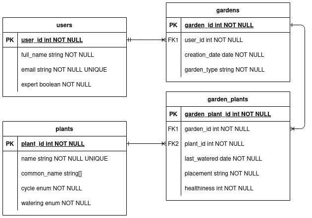

# coder-t2a2

Webserver Flask API project for CoderAcademy course.

[Github Repo](https://github.com/willr42/coder-t2a2).

[Project Management Board](https://trello.com/b/C1nWwPAe/t2a2-flask-api).

# Installation - Automatic

This repo comes with a setup script designed to help you install and run the project. Note that this project requires an installation of **Postgresql** and **Python3**.

1. Clone the repo with `git clone`.
2. CD into the root of the repo and run `./src/setup.sh`. This script should automatically configure the Postgresql database for you, create a new user, create the necessary environment variable file, install the required Python libraries and run the application.

# Installation - Manual

It is possible to manually configure this application, but it requires several steps.

1. Create a Postgres database named `plantapi` with a user named `plant_admin` with a password of your choice.
2. Create a .env file at the root of the project with the following contents;

```shell
DATABASE_URL="postgresql+psycopg2://plantadmin:<your password>@localhost:5432/plantapi"
SECRET_KEY="<your secret key - any random string>"
```

3. Create a Python venv with `python -m venv .venv` and source it with `source .venv/bin/activate`.
4. Install the dependencies with `pip install -r requirements.txt`.
5. Create and seed the database with `flask db create; flask db seed`.
6. Run the server with `flask run`.

# Usage

1. From the root of the repo, type `source .venv/bin/activate`.
2. Type `flask run`, provided you have created and seeded the database. If not, type `flask db drop; flask db create; flask db seed`. These commands also work individually.

# R1 Identification of the problem you are trying to solve by building this particular app.

Amateur horticulturalists are faced with a huge knowledge area they need to track - all the varieties of plants they can keep. How much water they need, how often, what sort of soil they need, their climate conditions, and so on. And tracking the plants you actually own can be just as complicated.

# R2 Why is it a problem that needs solving?

My API will allow a user to create their own virtual Garden. They can register an account using their email. They can then create a new Garden, and begin adding plants to it. This Garden will track the plants inside it, and track what plants have been watered recently, what have yet to be watered, and if any are overdue for their next watering. Creating this virtual representation of a garden means users can be in more control of their hobby than ever.

# R3 Why have you chosen this database system. What are the drawbacks compared to others?

## Reasons

I've chosen PostgreSQL (hereafter just "Postgres") as my database system of choice for this project. Postgres is an open-source relational database management system (RDBMS). Primarily, I've chosen it because I'm already familiar with the basic operations of Postgres including creating new databases, tables, and working with data, as well as connecting it to my ORM (SQLAlchemy). It seemed pragmatic to focus on the implementation of the API rather than learning a new database system.

I've also chosen Postgres with the intention of using some of its extended features to make managing the data in my application easier. Postgres is technically an object-relational database management system (ORDBMS), a subset of RDBMS that use object-oriented programming (OOP) techniques to let you create complex relations between data, like inheritance, objects, and classes. While I don't plan on using these specific features, I think the idea of **enums** will be useful. Enums are available in several other RDBMS, and they're essentially a field that are constrained by a pre-defined list of strings. This means you can reinforce integrity at the database level rather than the application level.

The other Postgres feature I plan on using is the Array type. Arrays let you store a list of values rather than a single value in a field. For something like the "common name" of a plant, which may include many different options, or not exist at all, an Array type seemed to make the most sense here.

## Drawbacks

One of the most-cited drawbacks of Postgres is often the steep learning curve, but since I've already used it on a few projects, I've mitigated most of that drawback.

As an open-source project, Postgres doesn't get the support of something like Oracle Server, but that's not a problem for the smaller scope of this assignment. There is also a wide variety of support available through online resources, plenty for hobby projects.

Finally, some people have found that Postgres can be more resource-intensive than MySQL or other RDBMS. I also think the limited scope helps with this drawback.

# R4 Identify and discuss the key functionalities and benefits of an ORM

An ORM is an Object-Relational-Mapper. Without an ORM, we'd be forced to;

- Craft our own hand-written SQL queries for every single endpoint in our application
- Handwrite how we load data from the database into the application, and vice-versa

An ORM _abstracts_ this functionality. We write objects in an OOP style in our source code. The ORM translates those code artifacts into the relations in the database - hence the "object-relational-mapper" acronym.

The key benefits of an ORM are mainly the fact that we move away from writing SQL, which is like writing another additional language as well as our backend. Additionally, if you use a popular, well-maintained ORM, the security is likely to be better than handcrafted SQL queries - the authors of such libraries are experts in SQL and avoiding SQL injection attacks. If the ORM is properly decoupled from the database, it enables us to quickly and easily change out the database as needed, without the need to change anything in the application itself.

An ORM lets us use the OOP conventions we use in our regular programming to interact with the database as well. Because we're interacting with our code, not writing SQL, we can use the features of our IDE to validate these classes and fields.

To turn the tables for a little, though, some developers swear off ORMs as an unneeded overhead, and instead reach for "query builders". These give you the benefit of stepping away from writing SQL yourself, but without going towards a full object model as used by ORMs.

# R5 Document all endpoints for your API

## Authentication

`/auth` url prefix.

### POST

<code><b>/auth/register/</b></code> &mdash; registers a new user acccount

#### **Parameters**

None

#### **JSON Body**

| name      | type     | data type | description                      |
| --------- | -------- | --------- | -------------------------------- |
| full_name | required | string    | N/A                              |
| email     | required | string    | Must be unique                   |
| password  | required | string    | Must be longer than 6 characters |

#### **Responses**

| http code | content-type       | response                     |
| --------- | ------------------ | ---------------------------- |
| `200`     | `application/json` | `{"token": "<jwt>"}`         |
| `400`     | `application/json` | `{"error": "error message"}` |

<code><b>/auth/login/</b></code> &mdash; logins in an existing acccount

#### **Parameters**

None

#### **JSON Body**

| name     | type     | data type | description                      |
| -------- | -------- | --------- | -------------------------------- |
| email    | required | string    | Must be unique                   |
| password | required | string    | Must be longer than 6 characters |

#### **Responses**

| http code | content-type       | response                                      |
| --------- | ------------------ | --------------------------------------------- |
| `200`     | `application/json` | `{"token": "<jwt>"}`                          |
| `401`     | `application/json` | `{"error": "Username or password incorrect"}` |

---

## Plants

`/plants` url prefix.

### GET

<code><b>/plants/</b></code> &mdash; Gets all plants

#### **Parameters**

None

#### **JSON Body**

None

#### **Responses**

| http code | content-type       | response                                                                                                                                 |
| --------- | ------------------ | ---------------------------------------------------------------------------------------------------------------------------------------- |
| `200`     | `application/json` | `[{"plant_id": 1,"watering": "minimal","name": "aloe vera","cycle": "perennial","common_name": ["aloe","chinese aloe"]}, <more plants>]` |

<code><b>/plants/{plant_id}</b></code> &mdash; Gets a single plant

#### **Parameters**

| name     | type     | data type | description    |
| -------- | -------- | --------- | -------------- |
| plant_id | required | int       | Must be unique |

#### **JSON Body**

None

#### **Responses**

| http code | content-type       | response                                                                                                                |
| --------- | ------------------ | ----------------------------------------------------------------------------------------------------------------------- |
| `200`     | `application/json` | `{"plant_id": 1,"watering": "minimal","name": "aloe vera","cycle": "perennial","common_name": ["aloe","chinese aloe"]}` |
| `404`     | `application/json` | `{"error":"plant_id does not exist"}`                                                                                   |

### POST

<code><b>/plants/</b></code> &mdash; If a user is an expert, adds a new plant. **This endpoint requires a valid JWT access token, as issued by the `/auth/register` or `/auth/login` routes.** This particular route is further protected by authorization - if a user is not an expert, they will not have the right credentials to call this endpoint.

#### **Parameters**

None

#### **JSON Body**

| name        | type     | data type       | description                                      |
| ----------- | -------- | --------------- | ------------------------------------------------ |
| name        | required | string          | The scientific name of the plant. Must be unique |
| common_name | optional | list\[strings\] | A list of common names                           |
| cycle       | required | string          | Must be perennial, annual, biennial, or biannual |
| watering    | required | string          | Must be frequent, average, minimal or none       |

#### **Responses**

| http code | content-type       | response                                                                                                                                                                                                                                   |
| --------- | ------------------ | ------------------------------------------------------------------------------------------------------------------------------------------------------------------------------------------------------------------------------------------ |
| `200`     | `application/json` | `[{"plant_id": 1,"watering": "minimal","name": "aloe vera","cycle": "perennial","common_name": ["aloe","chinese aloe"]}, <more plants>]`                                                                                                   |
| `400`     | `application/json` | `{"error": "error message"}`                                                                                                                                                                                                               |
| `401`     | `application/json` | `{"error":"The server could not verify that you are authorized to access the URL requested. You either supplied the wrong credentials (e.g. a bad password), or your browser doesn't understand how to supply the credentials required."}` |
| `409`     | `application/json` | `{"error":"Plant by that name already exists", "resource":<plant_id>}`                                                                                                                                                                     |

### PUT

<code><b>/plants/{plant_id}/</b></code> &mdash; If a user is an expert, updates a plant. **This endpoint requires a valid JWT access token, as issued by the `/auth/register` or `/auth/login` routes.** This particular route is further protected by authorization - if a user is not an expert, they will not have the right credentials to call this endpoint.

#### **Parameters**

| name     | type     | data type | description    |
| -------- | -------- | --------- | -------------- |
| plant_id | required | int       | Must be unique |

#### **JSON Body**

| name        | type     | data type       | description                                       |
| ----------- | -------- | --------------- | ------------------------------------------------- |
| name        | optional | string          | The scientific name of the plant. Must be unique. |
| common_name | optional | list\[strings\] | A list of common names                            |
| cycle       | optional | string          | Must be perennial, annual, biennial, or biannual  |
| watering    | optional | string          | Must be frequent, average, minimal or none        |

#### **Responses**

| http code | content-type       | response                                                                                                                                                                                                                                   |
| --------- | ------------------ | ------------------------------------------------------------------------------------------------------------------------------------------------------------------------------------------------------------------------------------------ |
| `200`     | `application/json` | `[{"plant_id": 1,"watering": "minimal","name": "aloe vera","cycle": "perennial","common_name": ["aloe","chinese aloe"]}, <more plants>]`                                                                                                   |
| `400`     | `application/json` | `{"error": "error message"}`                                                                                                                                                                                                               |
| `401`     | `application/json` | `{"error":"The server could not verify that you are authorized to access the URL requested. You either supplied the wrong credentials (e.g. a bad password), or your browser doesn't understand how to supply the credentials required."}` |
| `409`     | `application/json` | `{"error":"Plant by that name already exists", "resource":<plant_id>}`                                                                                                                                                                     |

### DELETE

<code><b>/plants/{plant_id}/</b></code> &mdash; If a user is an expert, deletes a plant. **This endpoint requires a valid JWT access token, as issued by the `/auth/register` or `/auth/login` routes.** This particular route is further protected by authorization - if a user is not an expert, they will not have the right credentials to call this endpoint.

#### **Parameters**

| name     | type     | data type | description    |
| -------- | -------- | --------- | -------------- |
| plant_id | required | int       | Must be unique |

#### **JSON Body**

None

#### **Responses**

| http code | content-type       | response                                                                                                                                                                                                                                   |
| --------- | ------------------ | ------------------------------------------------------------------------------------------------------------------------------------------------------------------------------------------------------------------------------------------ |
| `204`     | None               | None                                                                                                                                                                                                                                       |
| `401`     | `application/json` | `{"error":"The server could not verify that you are authorized to access the URL requested. You either supplied the wrong credentials (e.g. a bad password), or your browser doesn't understand how to supply the credentials required."}` |
| `404`     | `application/json` | `{"error":"plant_id does not exist"}`                                                                                                                                                                                                      |

---

## Gardens

`/gardens` url prefix.

### GET

<code><b>/gardens/</b></code> &mdash; Gets all gardens associated with a current user. **This endpoint requires a valid JWT access token, as issued by the `/auth/register` or `/auth/login` routes.**.

#### **Parameters**

None

#### **JSON Body**

None

#### **Responses**

| http code | content-type       | response                                                                                                                                                                                                                                   |
| --------- | ------------------ | ------------------------------------------------------------------------------------------------------------------------------------------------------------------------------------------------------------------------------------------ |
| `200`     | `application/json` | `[{"garden_id": 3,"garden_plants": [{"garden_plant_id": <id>}],"creation_date": "2020-02-02","user_id": 2,"garden_type": "terrarium"}]`                                                                                                    |
| `401`     | `application/json` | `{"error":"The server could not verify that you are authorized to access the URL requested. You either supplied the wrong credentials (e.g. a bad password), or your browser doesn't understand how to supply the credentials required."}` |
| `404`     | `application/json` | `{"error":"user has no gardens"}`                                                                                                                                                                                                          |

### POST

<code><b>/gardens/</b></code> &mdash; Creates a new garden for a user. **This endpoint requires a valid JWT access token, as issued by the `/auth/register` or `/auth/login` routes..**

#### **Parameters**

None

#### **JSON Body**

| name        | type     | data type | description                                                |
| ----------- | -------- | --------- | ---------------------------------------------------------- |
| garden_type | required | string    | The type of garden ("inside", "outside", "terrarium", etc) |

#### **Responses**

| http code | content-type       | response                                                                                                      |
| --------- | ------------------ | ------------------------------------------------------------------------------------------------------------- |
| `200`     | `application/json` | `{"garden_id": 3,"garden_plants": [],"creation_date": "2020-02-02","user_id": 2,"garden_type": "terrarium"}]` |
| `400`     | `application/json` | `{"error": "error message"}`                                                                                  |

### DELETE

<code><b>/gardens/{garden_id}/</b></code> &mdash; Delete a garden owned by the current user. **This endpoint requires a valid JWT access token, as issued by the `/auth/register` or `/auth/login` routes.**

#### **Parameters**

| name      | type     | data type | description    |
| --------- | -------- | --------- | -------------- |
| garden_id | required | int       | Must be unique |

#### **JSON Body**

None

#### **Responses**

| http code | content-type       | response                                                                                                                                                                                                                                   |
| --------- | ------------------ | ------------------------------------------------------------------------------------------------------------------------------------------------------------------------------------------------------------------------------------------ |
| `204`     | None               | None                                                                                                                                                                                                                                       |
| `401`     | `application/json` | `{"error":"The server could not verify that you are authorized to access the URL requested. You either supplied the wrong credentials (e.g. a bad password), or your browser doesn't understand how to supply the credentials required."}` |
| `404`     | `application/json` | `{"error":"garden_id does not exist"}`                                                                                                                                                                                                     |

---

## GardenPlants

`/gardenplants` url prefix.

### GET

<code><b>/gardenplants/{garden_id}/</b></code> &mdash; Gets all plants in a garden associated with a current user. **This endpoint requires a valid JWT access token, as issued by the `/auth/register` or `/auth/login` routes.**.

#### **Parameters**

| name      | type     | data type | description    |
| --------- | -------- | --------- | -------------- |
| garden_id | required | int       | Must be unique |

#### **JSON Body**

None

#### **Responses**

| http code | content-type       | response                                                                                                                                                                                                                                   |
| --------- | ------------------ | ------------------------------------------------------------------------------------------------------------------------------------------------------------------------------------------------------------------------------------------ |
| `200`     | `application/json` | `[{"plant_id": 1,"garden_plant_id": 4,"healthiness": 2,"garden_id": 3,"placement": "indoors","last_watered": "2021-01-01"}]`                                                                                                               |
| `401`     | `application/json` | `{"error":"The server could not verify that you are authorized to access the URL requested. You either supplied the wrong credentials (e.g. a bad password), or your browser doesn't understand how to supply the credentials required."}` |
| `404`     | `application/json` | `{"error":"garden_id does not exist"}`                                                                                                                                                                                                     |

<code><b>/gardenplants/{garden_id}/{garden_plant_id}></b></code> &mdash; Gets a single plant in a garden associated with a current user. **This endpoint requires a valid JWT access token, as issued by the `/auth/register` or `/auth/login` routes.**.

#### **Parameters**

| name            | type     | data type | description    |
| --------------- | -------- | --------- | -------------- |
| garden_id       | required | int       | Must be unique |
| garden_plant_id | required | int       | Must be unique |

#### **JSON Body**

None

#### **Responses**

| http code | content-type       | response                                                                                                                                                                                                                                   |
| --------- | ------------------ | ------------------------------------------------------------------------------------------------------------------------------------------------------------------------------------------------------------------------------------------ |
| `200`     | `application/json` | `{"plant_id": 1,"healthiness": 2,"garden_id": 3,"placement": "indoors","last_watered": "2021-01-01"}`                                                                                                                                      |
| `401`     | `application/json` | `{"error":"The server could not verify that you are authorized to access the URL requested. You either supplied the wrong credentials (e.g. a bad password), or your browser doesn't understand how to supply the credentials required."}` |
| `404`     | `application/json` | `{"error":"garden_id does not exist"}`                                                                                                                                                                                                     |
| `404`     | `application/json` | `{"error":"garden_plant does not exist in this garden"}`                                                                                                                                                                                   |

### POST

<code><b>/gardenplants/{garden_id}/</b></code> &mdash; Creates a new plant in a garden. **This endpoint requires a valid JWT access token, as issued by the `/auth/register` or `/auth/login` routes..**

#### **Parameters**

| name      | type     | data type | description    |
| --------- | -------- | --------- | -------------- |
| garden_id | required | int       | Must be unique |

#### **JSON Body**

| name         | type     | data type | description                                                                  |
| ------------ | -------- | --------- | ---------------------------------------------------------------------------- |
| plant_id     | required | int       | The id of a plant in the plants table                                        |
| last_watered | required | date      | YYYY-MM-DD iso format                                                        |
| placement    | required | string    | The location in the garden relative to the sun. IE. "Full shade", "full sun" |
| healthiness  | required | int       | Track how healthy the plant is from 1 to 10                                  |

#### **Responses**

| http code | content-type       | response                                                                                                                                                                                                                                   |
| --------- | ------------------ | ------------------------------------------------------------------------------------------------------------------------------------------------------------------------------------------------------------------------------------------ |
| `200`     | `application/json` | `{"garden_id": 3,"garden_plants": [],"creation_date": "2020-02-02","user_id": 2,"garden_type": "terrarium"}]`                                                                                                                              |
| `400`     | `application/json` | `{"error": "error message"}`                                                                                                                                                                                                               |
| `401`     | `application/json` | `{"error":"The server could not verify that you are authorized to access the URL requested. You either supplied the wrong credentials (e.g. a bad password), or your browser doesn't understand how to supply the credentials required."}` |
| `404`     | `application/json` | `{"error":"garden_id does not exist"}`                                                                                                                                                                                                     |
| `404`     | `application/json` | `{"error":"plant_id not found "}`                                                                                                                                                                                                          |

### PUT

<code><b>/gardenplants/{garden_id}/{garden_plant_id}</b></code> &mdash; Updates an existing plant in a garden. **This endpoint requires a valid JWT access token, as issued by the `/auth/register` or `/auth/login` routes..**

#### **Parameters**

| name            | type     | data type | description    |
| --------------- | -------- | --------- | -------------- |
| garden_id       | required | int       | Must be unique |
| garden_plant_id | required | int       | Must be unique |

#### **JSON Body**

| name         | type     | data type | description                                                                  |
| ------------ | -------- | --------- | ---------------------------------------------------------------------------- |
| last_watered | optional | date      | YYYY-MM-DD iso format                                                        |
| placement    | optional | string    | The location in the garden relative to the sun. IE. "Full shade", "full sun" |
| healthiness  | optional | int       | Track how healthy the plant is from 1 to 10                                  |
| garden_id    | optional | int       | The ID of another garden to move this plant into                             |

#### **Responses**

| http code | content-type       | response                                                                                                                                                                                                                                   |
| --------- | ------------------ | ------------------------------------------------------------------------------------------------------------------------------------------------------------------------------------------------------------------------------------------ |
| `200`     | `application/json` | `{"garden_id": 3,"garden_plants": [],"creation_date": "2020-02-02","user_id": 2,"garden_type": "terrarium"}]`                                                                                                                              |
| `400`     | `application/json` | `{"error": "error message"}`                                                                                                                                                                                                               |
| `401`     | `application/json` | `{"error":"The server could not verify that you are authorized to access the URL requested. You either supplied the wrong credentials (e.g. a bad password), or your browser doesn't understand how to supply the credentials required."}` |
| `404`     | `application/json` | `{"error":"garden_id does not exist"}`                                                                                                                                                                                                     |
| `404`     | `application/json` | `{"error":"garden_plant does not exist in this garden"}`                                                                                                                                                                                   |

### DELETE

<code><b>/gardenplants/{garden_id}/{garden_plant_id}/</b></code> &mdash; Delete a garden plant owned by the current user. **This endpoint requires a valid JWT access token, as issued by the `/auth/register` or `/auth/login` routes.**

#### **Parameters**

| name            | type     | data type | description    |
| --------------- | -------- | --------- | -------------- |
| garden_id       | required | int       | Must be unique |
| garden_plant_id | required | int       | Must be unique |

#### **JSON Body**

None

#### **Responses**

| http code | content-type       | response                                                                                                                                                                                                                                   |
| --------- | ------------------ | ------------------------------------------------------------------------------------------------------------------------------------------------------------------------------------------------------------------------------------------ |
| `204`     | None               | None                                                                                                                                                                                                                                       |
| `401`     | `application/json` | `{"error":"The server could not verify that you are authorized to access the URL requested. You either supplied the wrong credentials (e.g. a bad password), or your browser doesn't understand how to supply the credentials required."}` |
| `404`     | `application/json` | `{"error":"garden_id does not exist"}`                                                                                                                                                                                                     |
| `404`     | `application/json` | `{"error":"garden_plant does not exist in this garden"}`                                                                                                                                                                                   |

# R6 An ERD for your app



# R7 Detail any third party services that your app will use

In terms of general third party services;

I intend to use Perenual's [Plant API](https://perenual.com/docs/api) to generate some initial seed data for my database based on the most popular houseplants in Australia. Perenual's API is still fairly limited but I hope to retrieve the data necessary for this project.

The source code is hosted on Github, and I use Trello for project management.

## Third-party Libraries

As a Flask application, my app will draw on various third-party libraries to function. Here are the top-level dependencies (note, some of these may have their own internal dependencies).

- Black for code formatting
- Flask, as the web server
- Flask-Bcrypt, for password encryption
- Flask-JWT-Extended, for JWT generation & management
- Flask-Marshmallow, for serializing Python to JSON
- Flask-SQLAlchemy, a wrapper library for SQLAlchemy
- psycopg2, a Python database adapter for Postgres
- python-dotenv, enabling me to use environmental variables in Flask config
- SQLAlchemy, an ORM

# R8 Describe your projects models in terms of the relationships they have with each other

My model code ultimately ended up being quite straightforward.

## User

```python
class User(db.Model):
    __tablename__ = "users"

    user_id = db.Column(db.Integer, nullable=False, primary_key=True)
    full_name = db.Column(db.String(), nullable=False)
    email = db.Column(db.String(), nullable=False, unique=True)
    password = db.Column(db.String(), nullable=False)
    expert = db.Column(db.Boolean, nullable=False, default=False)

    garden = db.relationship("Garden", back_populates="user")
```

This is the User model. Users has a series of fields, and one relationship, to the Garden model. But as it is a one-to-many relationship, the `garden` does not appear in this class - we simply have to include the relationship so SQLAlchemy knows this connection exists.

## Plant

```python

class Cycle(enum.Enum):
    perennial = "perennial"
    annual = "annual"
    biennial = "biennial"
    biannual = "biannual"


# Watering amount required
class Watering(enum.Enum):
    frequent = "frequent"
    average = "average"
    minimal = "minimal"
    none = "none"


class Plant(db.Model):
    __tablename__ = "plants"

    plant_id = db.Column(db.Integer, nullable=False, primary_key=True)
    name = db.Column(db.String(), nullable=False, unique=True)
    common_name = db.Column(ARRAY(db.String()), nullable=False)
    cycle = db.Column(db.Enum(Cycle), nullable=False)
    watering = db.Column(db.Enum(Watering), nullable=False)

    garden_plant = db.relationship(
        "GardenPlant", back_populates="plant", cascade="all, delete"
    )
```

The Plant model is similar. A series of fields, most of which are self-explanatory. The `common_name` uses the previously mentioned Postgres Array type to allow me to store a list of strings in the one field, which makes sense as the data is grouped - it's just a list of the everyday names used to refer to plants. Cycle and Watering use python's `enum` feature, which allows you to create an object with a pre-defined value set, and this translates seamlessly into Postgres' enums.

The relationship here is `garden_plant`. Every GardenPlant row has a plant_id, so it's a one-to-many relationship (there may be many GardenPlants with the one plant_id, but it's always one and only one per row).

## Garden

```python
class Garden(db.Model):
    __tablename__ = "gardens"

    garden_id = db.Column(db.Integer, nullable=False, primary_key=True)
    creation_date = db.Column(db.Date(), nullable=False)
    garden_type = db.Column(db.String(), nullable=False)

    user_id = db.Column(
        db.Integer, db.ForeignKey("users.user_id", ondelete="CASCADE"), nullable=False
    )
    user = db.relationship("User", back_populates="garden")

    garden_plants = db.relationship("GardenPlant", back_populates="garden")
```

The Garden model is where relationships start becoming a bit more complex. Every Garden has an associated User, which is why each row has a `user_id`. When the user is deleted, the associated Gardens must be deleted as well, which is the `ondelete="CASCADE"` you see in the definition line. Every GardenPlant also has its own garden_id, so this relationship definition appears here.

## GardenPlant

```python
class GardenPlant(db.Model):
    __tablename__ = "garden_plants"

    garden_plant_id = db.Column(db.Integer, nullable=False, primary_key=True)

    last_watered = db.Column(db.Date, nullable=False)
    placement = db.Column(db.String(), nullable=False)
    healthiness = db.Column(db.Integer, nullable=False, default=5)

    garden_id = db.Column(db.Integer,db.ForeignKey("gardens.garden_id", ondelete="CASCADE"),)
    garden = db.relationship("Garden", back_populates="garden_plants")

    plant_id = db.Column(db.Integer, db.ForeignKey("plants.plant_id", ondelete="CASCADE"), nullable=False)
    plant = db.relationship("Plant", back_populates="garden_plant",)


```

The GardenPlant model is the most complex. Here, we connect all the other models - the User through the Garden, and the Garden and Plants within it. The `garden_id` is a foreign key from the Garden table. When a Garden is deleted, all associated GardenPlants are deleted as well. We define both the column and the relationship, as is typical with SQLAlchemy. I used the newer `back_populates` API rather than `backref` - this just means you must create bi-directional `db.relationship` objects on each Model, that back_populate each other.

When a Plant is deleted, we see a similar cascade to remove all associated GardenPlants - as a null value of a Plant species wouldn't make sense.

I believe that my model code accurately reflects my ERD. The most important things I found when creating this model was thinking carefully about the relationships and how they should be modelled.

# R9 Discuss the database relations to be implemented in your application

There are four main relations in this project. Users, gardens, plants, and the table that connects a Garden with the Plants inside it (called gardenplants).

Users are how we represent the user in the app. The primary key is a surrogate key, an autoincrementing integer ID. They have a `full_name` field to store their personal information, which might be important for later expansion of the API or a frontend. They have an email for communicating with users, and a field called `expert` which determines whether they're able to make changes to the Plants database.

We can see this in the ERD, which lists each field, as well as the user's connection to gardens.

A user can have many gardens. Each garden has a connection to the user that created it, and a `creation_date` to keep track of when it was created, a `garden_type` which represents what sort of garden the user has (eg. "indoor", "outdoor" or even "terrarium") and a surrogate primary key. The line from user to garden indicates that one and only one user can have one to many gardens.

Plants are the main data being stored in the API, along with the Gardens and their connection to them. The plant table contains a field of `name`, which represents the scientific name of the plant, and an array of strings called `common_name`. Arrays are a Postgres feature and allow us to store multiple strings in a singular field. Both `cycle` and `watering` are enums. This has the effect of limiting duplication and enforcing specific values at the database level. The primary key is the ubiquitous surrogate key.

The line from the plants table to the garden_plants table indicates that one plant may appear in one or more garden_plant rows. This should make sense, as the plant is the species of plant, whereas we can think of a garden_plant as a specific "instance" of a plant in a users garden.

Garden_plants is the final table, which connects the garden a user has created with plants. Thus we have two foreign keys, one from gardens, one from plants. The `last_watered` field keeps track of when a user has last watered a particular plant. The `placement` field tracks the sun conditions the plant is placed in (full shade, full sun, or a mix). `Healthiness` is an integer from 1 to 10 that tracks exactly that — how well a plant is doing (10 being peak condition, 1 being on its last legs). Finally, the surrogate key of `garden_plant_id`.

In the ERD, the line between gardens and garden_plant indicates that one garden_id may appear in a row of garden_plants, which makes sense, as each garden_plant row has only one garden_id in it.

# R10 Describe the way tasks are allocated and tracked in your project

While I'm a team of one, I'm running this project in an Agile way. I've developed a backlog of features that I need in my app. There are some dependencies, which means being aware of assigning myself tasks before I'm able to actually complete them, so I'm using a Trello board where the hierarchy in the list represents their ability to be completed. When generating the backlog, I left notes for myself in terms of potential pitfalls or things to watch out for.

The process involves moving each card into In Dev, where I work on the particular feature. Once complete, I move it to Dev Done. Tasks in Dev Done are considered provisionally complete. In a regular rhythm, I revisit the tasks in Dev Done and consider their future. Either they have generated further tasks I couldn't foresee, which go into the backlog. Or they require further development that I couldn't foresee, so they stay in this column. Or they are fully completed, in which case they enter Done.

This Kanban style of working is very visual and tactile, and I found it worked well on the previous assignment.

For full details, see my [Garden API Trello](https://trello.com/b/C1nWwPAe/t2a2-flask-api) board.
